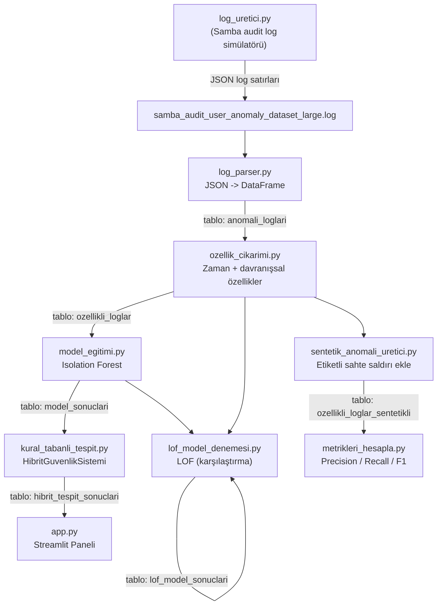

# 🛡️ Anomali Tespit Merkezi

Samba kimlik doğrulama (audit) loglarını **kural tabanlı** ve **yapay zeka destekli (Isolation Forest / LOF)** yöntemleri birleştirerek analiz eden hibrit bir anomali/tehdit tespit sistemi. Uçtan uca veri işleme hattı SQLite üzerinde çalışır ve sonuçlar interaktif bir **Streamlit** panelinde görselleştirilir.

---

## 📌 Genel Bakış

Sistem, brute-force girişimleri, mesai dışı şüpheli girişleri ve bot/script davranışlarını hem sabit kurallarla hem de denetimsiz öğrenme (unsupervised learning) modelleriyle tespit eder. İki yaklaşımın ortak "evet" dediği kayıtlar **"Kesin Tehdit"** olarak işaretlenir, bu da yalnızca kural ya da yalnızca modele dayanan sistemlere göre yanlış pozitifleri azaltır.

Gerçek dünyada etiketli anomali verisi bulunmadığından proje, modelin başarısını ölçmek için **sentetik (etiketli) saldırı verisi enjekte edip** Precision / Recall / F1 metrikleriyle değerlendirme yapan ayrı bir mekanizma da içerir.

## ✨ Özellikler

- **Hibrit tespit motoru:** Kural tabanlı skorlama + Isolation Forest anomali skoru birleşimi
- **Davranışsal özellik mühendisliği:** Kullanıcı/IP bazlı 10 dakikalık kayan pencere (rolling window) istatistikleri
- **Model karşılaştırması:** Isolation Forest ile Local Outlier Factor (LOF) sonuçlarının Silhouette skoru üzerinden kıyaslanması
- **Sentetik veri ile objektif değerlendirme:** Bilinen saldırı örnekleri enjekte edilerek Precision, Recall, F1 ve karmaşıklık matrisi hesaplanır
- **Canlı log simülatörü:** Brute-force, hesap kilitlenmesi ve bot taraması senaryolarını üreten sürekli çalışan bir simülatör
- **İnteraktif Streamlit paneli:** Filtrelenebilir tablo, ihlal türü/zaman dağılım grafikleri, tek tıkla "logları yenile ve analiz et" butonu
- **Tek komutla uçtan uca çalıştırma:** `pipeline_calistir.py` ile tüm adımların otomatik sırayla koşturulması

## 🧭 Mimari / Veri Akışı



**Özet akış:**

1. **Üretim / Alım:** `log_uretici.py` gerçekçi Samba audit logları üretir (veya gerçek bir Samba audit log dosyası kullanılabilir).
2. **Ayrıştırma:** `log_parser.py` ham JSON log satırlarını temiz bir tabloya çevirip SQLite'a (`anomali_loglari`) yazar.
3. **Özellik Mühendisliği:** `ozellik_cikarimi.py` zaman bazlı (saat, hafta sonu, mesai dışı) ve davranışsal (kayan pencere) özellikler üretir → `ozellikli_loglar`.
4. **Model Eğitimi:** `model_egitimi.py` bu özelliklerle bir Isolation Forest eğitir, modeli/scaler'ı `.pkl` olarak dışa aktarır → `model_sonuclari`.
5. **Kural Motoru & Hibrit Karar:** `kural_tabanli_tespit.py`, sabit kurallarla model çıktısını birleştirip nihai risk skorunu hesaplar → `hibrit_tespit_sonuclari`.
6. **Görselleştirme:** `app.py`, bu son tabloyu okuyup canlı bir Streamlit panelinde sunar.
7. **Ayrıca (paralel/değerlendirme amaçlı):**
   - `lof_model_denemesi.py`: Isolation Forest sonuçlarını LOF ile kıyaslar.
   - `sentetik_anomali_uretici.py` + `metrikleri_hesapla.py`: Bilinen etiketli saldırılar enjekte edilerek modelin gerçek başarı oranı (Precision/Recall/F1) ölçülür.

## 📂 Proje Yapısı

| Dosya | Açıklama |
|---|---|
| `app.py` | Streamlit tabanlı gerçek zamanlı analiz/izleme paneli |
| `log_uretici.py` | Brute-force, hesap kilitlenmesi ve bot saldırısı senaryolarını simüle eden sürekli log üretici |
| `log_parser.py` | Ham JSON Samba audit loglarını ayrıştırıp SQLite'a yazar |
| `ozellik_cikarimi.py` | Zaman ve davranışsal (rolling window) özellik mühendisliği |
| `sentetik_anomali_uretici.py` | Değerlendirme amaçlı etiketli (bilinen) sahte saldırı kayıtları üretir |
| `model_egitimi.py` | Isolation Forest modelini eğitir, `.pkl` olarak dışa aktarır |
| `lof_model_denemesi.py` | Karşılaştırma amaçlı Local Outlier Factor (LOF) modeli |
| `metrikleri_hesapla.py` | Sentetik veriyle Precision / Recall / F1 / karmaşıklık matrisi hesaplar |
| `kural_tabanli_tespit.py` | Kural motoru + kural/YZ hibrit karar mantığı (`HibritGuvenlikSistemi` sınıfı) |
| `pipeline_calistir.py` | Tüm adımları sırasıyla çalıştıran orkestrasyon betiği |
| `isolation_forest_model.pkl` | Eğitilmiş Isolation Forest model dosyası |
| `scaler.pkl` | Eğitimde kullanılan `StandardScaler` nesnesi |

> Not: Repoda henüz `requirements.txt` bulunmuyor; gerekli kütüphaneler aşağıdaki Kurulum bölümünde listelenmiştir.

## ⚙️ Kurulum

```bash
git clone https://github.com/dila0704/Anomali_Tespit.git
cd Anomali_Tespit

python -m venv venv
source venv/bin/activate      # Windows: venv\Scripts\activate

pip install streamlit pandas plotly scikit-learn joblib numpy
```

## ▶️ Kullanım

### 1. Log verisi üretin (veya kendi Samba audit log dosyanızı kullanın)

```bash
python log_uretici.py
# Hızlı test için:
python log_uretici.py --test
```

Bu betik, `samba_audit_user_anomaly_dataset_large.log` dosyasına sürekli olarak JSON formatlı log satırları ekler (`Ctrl+C` ile durdurulabilir).

### 2. Analiz hattını (pipeline) çalıştırın

```bash
python pipeline_calistir.py
```

Bu komut sırasıyla `log_parser.py → ozellik_cikarimi.py → kural_tabanli_tespit.py → model_egitimi.py` betiklerini çalıştırıp sonuçları `log_veritabani.db` içine yazar.

> İlk kurulumda modelin (`isolation_forest_model.pkl`) ve `model_sonuclari` tablosunun oluşması için `model_egitimi.py` dosyasını en az bir kez, `kural_tabanli_tespit.py`'den **önce** çalıştırmanız gerekir:
> ```bash
> python log_parser.py
> python ozellik_cikarimi.py
> python model_egitimi.py
> python kural_tabanli_tespit.py
> ```

### 3. Paneli açın

```bash
streamlit run app.py
```

Panel içindeki **"🔄 Logları Yenile ve Analiz Et"** butonu, `pipeline_calistir.py` dosyasını arka planda tekrar çalıştırıp panonu otomatik günceller.

### 4. (Opsiyonel) Model başarısını objektif ölçün

```bash
python sentetik_anomali_uretici.py
python metrikleri_hesapla.py
```

Bu adım, veriye bilinen 100 sahte saldırı kaydı ekleyip modelin bunları ne oranda yakaladığını Precision/Recall/F1 ile raporlar.

### 5. (Opsiyonel) Isolation Forest'ı LOF ile kıyaslayın

```bash
python lof_model_denemesi.py
```

## 🧠 Kural Motoru (Hibrit Karar Mantığı)

`kural_tabanli_tespit.py` içindeki `HibritGuvenlikSistemi` sınıfı aşağıdaki kuralları uygular:

| Kural | Koşul | Risk Skoru |
|---|---|---|
| Brute-Force Şüphesi | Son 10 dk içinde 5'ten fazla başarısız giriş | +50 |
| Mesai Dışı Başarısız Giriş | Mesai dışı veya hafta sonu + başarısız giriş | +30 |
| Bot/Script Şüphesi | Aynı IP'den 1 sn'den kısa aralıklarla 50'den fazla istek | +40 |
| Hibrit Onay (YZ + Kural) | Kural skoru > 0 **ve** Isolation Forest da anomali demiş | +100 |

## 🗄️ Veritabanı Şeması (SQLite: `log_veritabani.db`)

| Tablo | Üreten Betik | İçerik |
|---|---|---|
| `anomali_loglari` | `log_parser.py` | Ayrıştırılmış ham log kayıtları |
| `ozellikli_loglar` | `ozellik_cikarimi.py` | Zaman + davranışsal özellikler eklenmiş veri |
| `model_sonuclari` | `model_egitimi.py` | Isolation Forest tahminleri |
| `hibrit_tespit_sonuclari` | `kural_tabanli_tespit.py` | Nihai hibrit karar (panelde kullanılır) |
| `lof_model_sonuclari` | `lof_model_denemesi.py` | LOF karşılaştırma sonuçları |
| `ozellikli_loglar_sentetikli` | `sentetik_anomali_uretici.py` | Etiketli sentetik saldırı verisiyle zenginleştirilmiş veri |

## 🛠️ Kullanılan Teknolojiler

- **Python 3**
- **Streamlit** — interaktif panel
- **Plotly Express** — grafikler
- **pandas / numpy** — veri işleme
- **scikit-learn** — Isolation Forest, Local Outlier Factor, standardizasyon ve değerlendirme metrikleri
- **SQLite** — hafif veri deposu
- **joblib** — model/scaler serileştirme

## 📈 Yol Haritası Fikirleri

- `requirements.txt` ve otomatik testler eklemek
- Gerçek zamanlı log akışı (dosya kuyruğu / syslog / Filebeat entegrasyonu)
- Model yeniden eğitimini zamanlanmış (scheduled) hale getirmek
- E-posta/Slack üzerinden "Kesin Tehdit" bildirimleri

## 📄 Lisans

Bu proje için henüz bir lisans dosyası tanımlanmamıştır.
