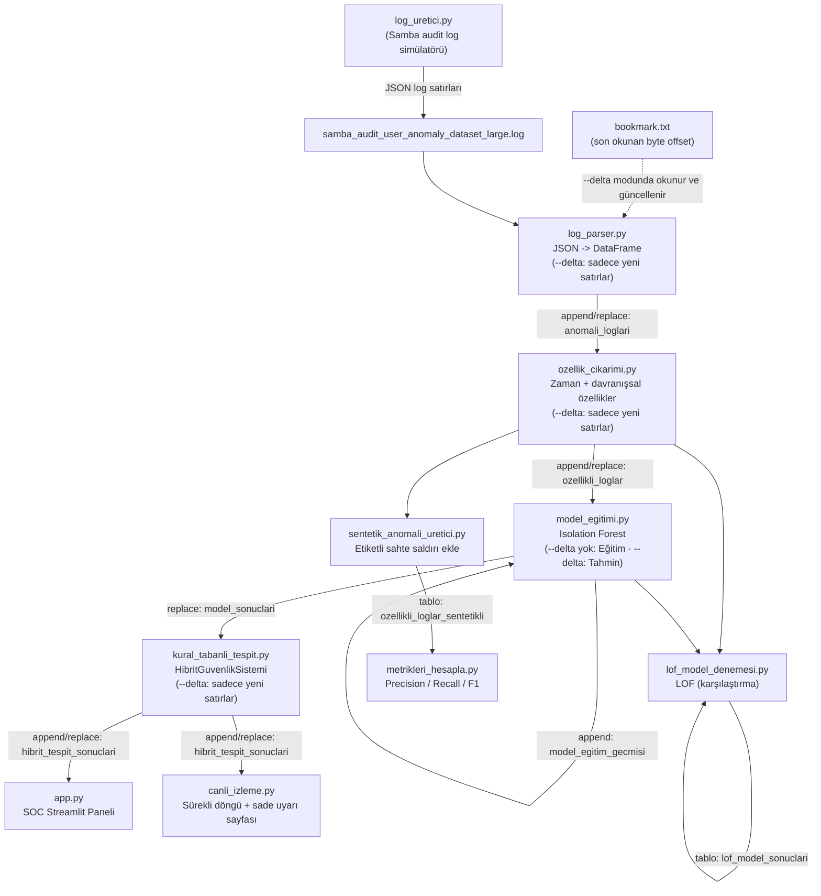

# 🛡️ Anomali Tespit Merkezi

Samba kimlik doğrulama (audit) loglarını **kural tabanlı** ve **yapay zeka destekli (Isolation Forest / LOF)** yöntemleri birleştirerek analiz eden hibrit bir anomali/tehdit tespit sistemi. Uçtan uca veri işleme hattı SQLite üzerinde çalışır, **artımlı (delta) okuma mimarisi** sayesinde sadece yeni loglar işlenir ve sonuçlar hem SOC (Güvenlik Operasyon Merkezi) temalı interaktif bir **Streamlit** panelinde hem de arka planda sürekli çalışan, sade bir **canlı anomali izleme** sayfasında görselleştirilir.

---

## 📌 Genel Bakış

Sistem, brute-force girişimleri, mesai dışı şüpheli girişleri ve bot/script davranışlarını hem sabit kurallarla hem de denetimsiz öğrenme (unsupervised learning) modelleriyle tespit eder. İki yaklaşımın ortak "evet" dediği kayıtlar **"Kesin Tehdit"** olarak işaretlenir, bu da yalnızca kural ya da yalnızca modele dayanan sistemlere göre yanlış pozitifleri azaltır.

Boru hattı (pipeline), her çalıştırmada tüm veriyi baştan işlemek yerine **delta modunda** sadece son çalıştırmadan bu yana eklenen logları işleyip mevcut tablolara ekler (append); bu da hem `pipeline_calistir.py`'ı hem de Streamlit panelindeki "Yeni Logları İncele" butonunu saniyeler içinde tamamlanabilir hale getirir. Panel de kendi tarafında yalnızca son 50.000 kaydı çekerek arayüzü hızlı tutar.

Gerçek dünyada etiketli anomali verisi bulunmadığından proje, modelin başarısını ölçmek için **sentetik (etiketli) saldırı verisi enjekte edip** Precision / Recall / F1 metrikleriyle değerlendirme yapan ayrı bir mekanizma da içerir.

## ✨ Özellikler

- **Hibrit tespit motoru:** Kural tabanlı skorlama + Isolation Forest anomali skoru birleşimi
- **Delta (artımlı) okuma mimarisi:** `bookmark.txt` ile log dosyasındaki son okunan byte konumu takip edilir; her adım (`log_parser.py`, `ozellik_cikarimi.py`, `model_egitimi.py`, `kural_tabanli_tespit.py`) sadece yeni kayıtları işleyip veritabanına **ekler (append)**, tüm veriyi yeniden işlemez
- **Kısa devre (short-circuit) mantığı:** İşlenecek yeni log yoksa betikler `exit code 99` ile çıkar, `pipeline_calistir.py` bu durumu yakalayıp kalan adımları atlayarak süreci güvenle sonlandırır
- **Eğitim / Tahmin modu ayrımı:** Tam taramada (`--tam-tarama`) Isolation Forest sıfırdan eğitilip `.pkl` olarak diske kaydedilir; delta modunda ise model diskten yüklenip sadece yeni kayıtlar için hızlı tahmin (`predict`) yapılır, yeniden eğitim yapılmaz
- **Otomatik yeniden eğitim (concept drift koruması):** `model_egitimi.py`, `--delta` ile çağrılsa bile son eğitimden bu yana biriken satır sayısı bir eşiği (varsayılan 5000) aşarsa modeli kendiliğinden sıfırdan yeniden eğitir; her eğitim `model_egitim_gecmisi` tablosuna (zaman, satır sayısı, Silhouette skoru) kaydedilir, model asla süresiz donuk kalmaz
- **Sürekli çalışan canlı izleme sayfası:** `canli_izleme.py`, arka planda `pipeline_calistir.py`'ı düzenli aralıklarla kendiliğinden çalıştırır ve ekranda sadece anomalileri gösterir; bir anomali bir kez görüldükten sonra tekrar "yeni" olarak flaşlanmaz, sadece gerçekten yeni tespitler öne çıkar
- **Pipeline gözlemlenebilirliği:** Her pipeline adımının süresi ve durumu (`Başarılı` / `Yeni Veri Yok` / `Hata`) `pipeline_calismalari` tablosuna otomatik loglanır
- **Eşzamanlı erişim güvenliği:** Tüm veritabanı bağlantılarında SQLite WAL modu + zaman aşımı (timeout) kullanılır; arka plan izleme döngüsü ile manuel bir tarama aynı anda çalışsa bile "database is locked" hatası alınmaz
- **Davranışsal özellik mühendisliği:** Kullanıcı/IP bazlı 10 dakikalık kayan pencere (rolling window) istatistikleri ve hızlı IP değişimi (impossible travel) tespiti
- **Model karşılaştırması:** Isolation Forest ile Local Outlier Factor (LOF) sonuçlarının Silhouette skoru üzerinden kıyaslanması
- **Sentetik veri ile objektif değerlendirme:** Bilinen saldırı örnekleri enjekte edilip, birden fazla tohum (seed) × birden fazla `contamination` değeri üzerinden ortalama ± standart sapma Precision/Recall/F1 ve karmaşıklık matrisi hesaplanır (tek noktalık, gürültüye açık bir ölçüm yerine)
- **Canlı log simülatörü:** Her döngüde ağırlıklı rastgele bir senaryo üreten sürekli çalışan bir simülatör — normal başarılı trafik (çoğunluk), brute-force, hesap kilitlenmesi, bot/script taraması, IP sıçraması (impossible travel), olası hesap ele geçirme ve hareketsiz hesap aktivasyonu
- **Kullanıcı bazlı terminal sorgulama:** `kullanici_sorgula.py` ile belirli bir kullanıcının davranış profili (rutin saat aralığı, en sık IP'ler, başarı oranları, saatlik yoğunluk grafiği) ve log/anomali kayıtları terminalde görüntülenebilir
- **SOC temalı, sekmeli Streamlit paneli:**
  - **Genel Tehdit Pano** sekmesi: filtrelenebilir tablo, ihlal türü/zaman dağılım grafikleri
  - **Derinlemesine Profil (UBA)** sekmesi: seçilen kullanıcı/IP için dijital ayak izi (toplam işlem, farklı IP sayısı, rutin çalışma saati, riskli hareket sayısı), saatlik yoğunluk grafiği ve normal/anomali durum dağılımı
  - **Nokta Atışı İzleme:** belirli bir kullanıcı veya kaynak IP seçip odaklı inceleme yapma
  - Tek tıkla "🚀 Yeni Logları İncele (Delta)" butonu ile arka planda pipeline'ı delta modunda tetikleme
- **Performans odaklı tasarım:** Panel son 50.000 kaydı çeker, tablo satır limiti ayarlanabilir slider ile kontrol edilir
- **Tek komutla uçtan uca çalıştırma:** `pipeline_calistir.py` ile tüm adımların otomatik sırayla koşturulması (varsayılan: delta modu, `--tam-tarama` ile tam yeniden işleme)

## 🧭 Mimari / Veri Akışı



**Özet akış:**

1. **Üretim / Alım:** `log_uretici.py` gerçekçi Samba audit logları üretir (veya gerçek bir Samba audit log dosyası kullanılabilir).
2. **Ayrıştırma:** `log_parser.py`, delta modunda `bookmark.txt`'teki byte konumundan itibaren dosyayı okuyup sadece yeni JSON satırlarını ayrıştırır ve SQLite'a (`anomali_loglari`) **ekler**; tam taramada dosyayı baştan okuyup tabloyu yeniden yazar.
3. **Özellik Mühendisliği:** `ozellik_cikarimi.py` zaman bazlı (saat, hafta sonu, mesai dışı) ve davranışsal (kayan pencere) özellikler üretir → `ozellikli_loglar`; delta modunda sadece yeni satırları işleyip ekler.
4. **Model Eğitimi / Tahmini:** `model_egitimi.py`, tam taramada bu özelliklerle bir Isolation Forest eğitip modeli/scaler'ı `.pkl` olarak dışa aktarır; delta modunda ise diskteki modeli yükleyip sadece yeni kayıtlar için hızlı tahmin yapar → `model_sonuclari`. Ayrıca `--delta` ile çağrılsa bile, son eğitimden bu yana yeterince yeni veri birikmişse (`model_egitim_gecmisi` tablosuna bakarak) kendiliğinden tam yeniden eğitime geçer.
5. **Kural Motoru & Hibrit Karar:** `kural_tabanli_tespit.py`, sabit kurallarla model çıktısını birleştirip nihai risk skorunu hesaplar; delta modunda sadece yeni satırları işleyip `hibrit_tespit_sonuclari` tablosuna ekler.
6. **Görselleştirme:** `app.py`, bu son tabloyu okuyup SOC temalı, sekmeli bir Streamlit panelinde (Genel Pano + Kullanıcı/IP bazlı UBA profili) sunar. `canli_izleme.py` ise bağımsız, ikinci bir arayüz olarak aynı tabloyu izler; arka planda pipeline'ı sürekli döngüde kendiliğinden tetikler ve ekranda sadece (yeni/görülmüş ayrımı yapılmış) anomalileri gösterir.
7. **Kısa devre:** Herhangi bir adımda işlenecek yeni veri yoksa ilgili betik `exit code 99` ile çıkar; `pipeline_calistir.py` bunu algılayıp kalan adımları atlayarak süreci hatasız sonlandırır. Her adımın süresi ve sonucu ayrıca `pipeline_calismalari` tablosuna loglanır.
8. **Ayrıca (paralel/değerlendirme amaçlı):**
   - `lof_model_denemesi.py`: Isolation Forest sonuçlarını LOF ile kıyaslar.
   - `sentetik_anomali_uretici.py` + `metrikleri_hesapla.py`: Bilinen etiketli saldırılar enjekte edilerek modelin gerçek başarı oranı, birden fazla tohum × `contamination` denemesi üzerinden ortalama Precision/Recall/F1 ile ölçülür.

## 📂 Proje Yapısı

| Dosya | Açıklama |
|---|---|
| `app.py` | SOC temalı, sekmeli (Genel Pano / UBA Profili) Streamlit analiz paneli |
| `canli_izleme.py` | Arka planda pipeline'ı sürekli döngüde kendiliğinden çalıştıran, sadece (yeni/görülmüş ayrımı yapılmış) anomalileri gösteren sade, bağımsız izleme sayfası |
| `kullanici_sorgula.py` | Belirli bir kullanıcının davranış profilini ve log/anomali kayıtlarını terminalde (renkli tablo) gösteren CLI aracı |
| `log_uretici.py` | Normal trafik, brute-force, hesap kilitlenmesi, bot taraması, IP sıçraması, hesap ele geçirme ve hareketsiz hesap senaryolarını ağırlıklı rastgele üreten sürekli log üretici |
| `log_parser.py` | Ham JSON Samba audit loglarını ayrıştırıp SQLite'a yazar; `--delta` ile `bookmark.txt` üzerinden sadece yeni satırları okur |
| `bookmark.txt` | Delta modunda log dosyasında en son okunan byte konumunu tutan takip dosyası (tam taramada sıfırlanır) |
| `ozellik_cikarimi.py` | Zaman ve davranışsal (rolling window) özellik mühendisliği; `--delta` ile sadece yeni satırları işler |
| `sentetik_anomali_uretici.py` | Değerlendirme amaçlı etiketli (bilinen) sahte saldırı kayıtları üretir |
| `model_egitimi.py` | Isolation Forest modelini eğitir/`.pkl` olarak dışa aktarır (tam tarama) veya diskteki modelle hızlı tahmin yapar (`--delta`); son eğitimden bu yana biriken satır sayısı bir eşiği aşarsa `--delta` ile çağrılsa dahi otomatik yeniden eğitir ve `model_egitim_gecmisi` tablosuna kaydeder |
| `lof_model_denemesi.py` | Karşılaştırma amaçlı Local Outlier Factor (LOF) modeli |
| `metrikleri_hesapla.py` | Sentetik veriyle, birden fazla tohum × `contamination` denemesi üzerinden ortalama ± std Precision / Recall / F1 / karmaşıklık matrisi hesaplar |
| `kural_tabanli_tespit.py` | Kural motoru + kural/YZ hibrit karar mantığı (`HibritGuvenlikSistemi` sınıfı); `--delta` ile sadece yeni satırları işleyip ekler |
| `pipeline_calistir.py` | Tüm adımları sırasıyla çalıştıran orkestrasyon betiği; varsayılan delta modu, `--tam-tarama` ile tam yeniden işleme, `exit 99` kısa devre yönetimi, her adımın süresini/durumunu `pipeline_calismalari` tablosuna loglar |
| `isolation_forest_model.pkl` | Eğitilmiş Isolation Forest model dosyası |
| `scaler.pkl` | Eğitimde kullanılan `StandardScaler` nesnesi |

## ⚙️ Kurulum

```bash
git clone https://github.com/dila0704/Anomali_Tespit.git
cd Anomali_Tespit

python -m venv venv
source venv/bin/activate      # Windows: venv\Scripts\activate

pip install -r requirements.txt
```

## ▶️ Kullanım

### 1. Log verisi üretin (veya kendi Samba audit log dosyanızı kullanın)

```bash
python log_uretici.py
# Hızlı test için:
python log_uretici.py --test
```

Bu betik, `samba_audit_user_anomaly_dataset_large.log` dosyasına sürekli olarak JSON formatlı log satırları ekler (`Ctrl+C` ile durdurulabilir).

### 2. Analiz hattını (pipeline) çalıştırın

İlk çalıştırmada henüz eğitilmiş bir model, `bookmark.txt` ve dolu tablolar olmadığı için **tam tarama** ile başlamanız gerekir:

```bash
python pipeline_calistir.py --tam-tarama
```

Bu komut sırasıyla `log_parser.py → ozellik_cikarimi.py → model_egitimi.py → kural_tabanli_tespit.py` betiklerini **tam tarama modunda** çalıştırır, Isolation Forest modelini sıfırdan eğitip `.pkl` dosyalarını oluşturur ve sonuçları `log_veritabani.db` içine yazar.

> Sıralama önemlidir: `kural_tabanli_tespit.py`, `model_egitimi.py`'ın ürettiği `model_sonuclari` tablosunu okur; bu yüzden model adımı kurallardan **önce** çalışmalıdır. Aksi halde kurallar bir önceki turdan kalma bayat model verisiyle çalışır.

Sonraki çalıştırmalarda argümansız komut varsayılan olarak **delta (artımlı) modda** çalışır; sadece `log_uretici.py`'ın ürettiği yeni loglar işlenir ve mevcut tablolara eklenir:

```bash
python pipeline_calistir.py
```

İşlenecek yeni log yoksa betikler `exit code 99` ile çıkar ve pipeline, hata vermeden "Kısa Devre" mesajıyla kalan adımları atlar.

### 3. Paneli açın

```bash
streamlit run app.py
```

Panel içindeki **"🚀 Yeni Logları İncele (Delta)"** butonu, `pipeline_calistir.py` dosyasını arka planda delta modunda tekrar çalıştırıp panoyu otomatik günceller. Panelde:

- **📈 Genel Tehdit Pano** sekmesinde metrikler, ihlal/zaman dağılım grafikleri ve son log tablosu,
- **🕵️‍♂️ Derinlemesine Profil (UBA)** sekmesinde ise "🎯 Nokta Atışı İzleme" alanından seçilen bir kullanıcı veya IP'nin dijital ayak izi, saatlik davranış grafiği ve normal/anomali dağılımı görüntülenir.

### 3b. (Alternatif) Sürekli çalışan canlı izleme sayfasını açın

```bash
streamlit run canli_izleme.py
```

Bu sayfa `app.py`'deki zengin panodan bağımsızdır ve elle tetiklemeye ihtiyaç duymaz: açılır açılmaz arka planda bir thread üzerinden `pipeline_calistir.py`'ı düzenli aralıklarla (varsayılan 10 saniye) kendiliğinden çalıştırır ve kendisi de düzenli aralıklarla (varsayılan 5 saniye) yenilenir. Ekranda sadece o an var olan anomaliler listelenir; anomali yoksa "sistem temiz" mesajı gösterilir. Bir anomali bu sayfada bir kez gösterildikten sonra "görülmüş" sayılır — aynı kayıt her yenilemede tekrar alarm olarak flaşlanmaz, sadece gerçekten yeni tespitler "🆕 YENİ" etiketiyle öne çıkar. İlk çalıştırmadan önce en az bir kez `python pipeline_calistir.py --tam-tarama` ile eğitilmiş bir model bulunmalıdır.

### 4. (Opsiyonel) Bir kullanıcıyı terminalde sorgulayın

```bash
python kullanici_sorgula.py <kullanici_adi>
python kullanici_sorgula.py <kullanici_adi> --sadece-anomali --limit 20
```

Terminalde kullanıcının özet bilgisi, davranış profili (rutin saat aralığı, en sık kullanılan IP'ler, başarısız giriş/mesai dışı/hafta sonu oranları), saatlik aktivite grafiği ve ayrıntılı log tablosu renkli olarak listelenir.

### 5. (Opsiyonel) Model başarısını objektif ölçün

```bash
python sentetik_anomali_uretici.py
python metrikleri_hesapla.py
```

Bu adım, veriye bilinen 100 sahte saldırı kaydı ekleyip modelin bunları ne oranda yakaladığını Precision/Recall/F1 ile raporlar.

### 6. (Opsiyonel) Isolation Forest'ı LOF ile kıyaslayın

```bash
python lof_model_denemesi.py
```

## 🔁 Delta (Artımlı) Okuma Mimarisi

Sistem, her seferinde tüm log geçmişini yeniden işlemek yerine yalnızca yeni verileri işleyerek hem `pipeline_calistir.py`'ı hem de panel yenilemesini hızlı tutar:

- **Byte-offset takibi:** `log_parser.py`, `--delta` bayrağıyla çalıştığında `bookmark.txt` içindeki son okunan byte konumundan (`file.seek`) devam eder ve okuma bitince yeni konumu tekrar `bookmark.txt`'e yazar.
- **Satır sayısı farkı ile delta tespiti:** `ozellik_cikarimi.py` ve `kural_tabanli_tespit.py`, önceki adımdaki tablo ile mevcut tablo arasındaki satır sayısı farkına (`toplam_satir - mevcut_satir`) bakarak yalnızca yeni satırları işleyip hedef tabloya **append** eder. `kural_tabanli_tespit.py` bu farkı `model_sonuclari` tablosuna göre hesapladığı için, `model_egitimi.py` pipeline'da ondan **önce** çalışmak zorundadır — aksi halde bayat veri okunur ve pipeline yanlışlıkla "yeni veri yok" sanıp erken durur.
- **Eğitim vs. Tahmin:** `model_egitimi.py`, tam taramada (`--tam-tarama`) modeli sıfırdan eğitip diske kaydeder ve Silhouette skorunu hesaplar; delta modunda ise diskteki `.pkl` dosyalarını yükleyip sadece `transform` + `predict` çalıştırır (yeniden `fit` yapılmaz), bu da işlem süresini önemli ölçüde kısaltır.
- **Otomatik yeniden eğitim eşiği:** `model_egitimi.py`, `model_egitim_gecmisi` tablosundaki son eğitim satır sayısıyla mevcut `ozellikli_loglar` satır sayısını karşılaştırır; fark `RETRAIN_ESIK_SATIR` (varsayılan 5000) değerini aşarsa `--delta` ile çağrılmış olsa bile modeli sıfırdan yeniden eğitir. Bu, modelin süresiz donuk kalmasını (concept drift) önler; dezavantajı, veri hacmi büyüdükçe her yeniden eğitimin süresinin de uzamasıdır (tam veri üzerinde `fit` yapıldığı için).
- **Kısa devre (short-circuit):** İşlenecek yeni veri olmayan bir adım `exit code 99` ile çıkar; `pipeline_calistir.py` bu kodu özel olarak yakalayıp geri kalan adımları atlar ve süreci hatasız olarak sonlandırır. `--tam-tarama` çalıştırıldığında ise tüm tablolar baştan yazılır (`replace`) ve `bookmark.txt` sıfırlanır.
- **Eşzamanlı erişim güvenliği:** Tüm `sqlite3.connect` çağrılarında `PRAGMA journal_mode=WAL` ve `timeout=15` kullanılır; böylece `canli_izleme.py`'ın arka plan döngüsü ile `app.py`'daki manuel tetikleme veya elle çalıştırılan bir `pipeline_calistir.py` aynı anda veritabanına erişse bile anında "database is locked" hatası alınmaz, kısa bir süre beklenip devam edilir.

## 🧠 Kural Motoru (Hibrit Karar Mantığı)

`kural_tabanli_tespit.py` içindeki `HibritGuvenlikSistemi` sınıfı aşağıdaki kuralları uygular:

| Kural | Koşul | Risk Skoru |
|---|---|---|
| Brute-Force Şüphesi | Son 10 dk içinde 5'ten fazla başarısız giriş | +50 |
| Mesai Dışı Başarısız Giriş | Mesai dışı veya hafta sonu + başarısız giriş **ve** son 10 dk içinde en az 2 başarısız deneme | +30 |
| Bot/Script Şüphesi | Aynı IP'den 1 sn'den kısa aralıklarla 50'den fazla istek | +40 |
| Uzun Aradan Sonra Ani Aktivite | Kullanıcının bir önceki işleminden bu yana 4 saatten uzun sessizlik | +20 |
| IP Sıçraması Şüphesi | Kullanıcı, önceki işleminden 5 dk içinde farklı bir IP'den görülüyor (impossible travel) | +35 |
| Olası Hesap Ele Geçirme | Son 10 dk içinde 3'ten fazla başarısız denemenin ardından başarılı giriş | +60 |
| Hibrit Onay (YZ + Kural) | Kural skoru > 0 **ve** Isolation Forest da anomali demiş | +100 |

> Not: "Mesai Dışı Başarısız Giriş" kuralına tekrar şartı (≥2 başarısız deneme) eklenmiştir; tek seferlik bir şifre yanlışı (insan hatası) artık anomali sayılmaz. Aksi halde mesai dışı zaman diliminin genişliği (günün ~%54'ü) yüzünden kural aşırı geniş tetikleniyor ve diğer daha spesifik örüntüleri gürültüye boğuyordu.

## 🗄️ Veritabanı Şeması (SQLite: `log_veritabani.db`)

| Tablo | Üreten Betik | İçerik |
|---|---|---|
| `anomali_loglari` | `log_parser.py` | Ayrıştırılmış ham log kayıtları (delta modunda append edilir) |
| `ozellikli_loglar` | `ozellik_cikarimi.py` | Zaman + davranışsal özellikler eklenmiş veri (delta modunda append edilir) |
| `model_sonuclari` | `model_egitimi.py` | Isolation Forest tahminleri |
| `hibrit_tespit_sonuclari` | `kural_tabanli_tespit.py` | Nihai hibrit karar (panelde kullanılır, delta modunda append edilir) |
| `lof_model_sonuclari` | `lof_model_denemesi.py` | LOF karşılaştırma sonuçları |
| `ozellikli_loglar_sentetikli` | `sentetik_anomali_uretici.py` | Etiketli sentetik saldırı verisiyle zenginleştirilmiş veri |
| `model_egitim_gecmisi` | `model_egitimi.py` | Her tam eğitimin zamanı, eğitildiği satır sayısı ve Silhouette skoru (otomatik yeniden eğitim kararı bu tablodan verilir) |
| `pipeline_calismalari` | `pipeline_calistir.py` | Her pipeline adımının çalışma zamanı, süresi (sn) ve durumu (`Başarılı` / `Yeni Veri Yok` / `Hata`) — pipeline'ın kendi sağlığını izlemek için |

> `bookmark.txt`, bir SQLite tablosu değildir; delta modunda `log_parser.py`'ın log dosyasında en son okuduğu byte konumunu tutan ayrı bir takip dosyasıdır.

## 🛠️ Kullanılan Teknolojiler

- **Python 3**
- **Streamlit** — interaktif, sekmeli SOC paneli
- **Plotly Express** — grafikler
- **pandas / numpy** — veri işleme
- **scikit-learn** — Isolation Forest, Local Outlier Factor, standardizasyon ve değerlendirme metrikleri
- **SQLite** — hafif veri deposu
- **joblib** — model/scaler serileştirme

## 📈 Yol Haritası Fikirleri

- ~~Model yeniden eğitimini zamanlanmış (scheduled) hale getirmek~~ ✅ `model_egitimi.py` artık satır eşiğine göre kendiliğinden yeniden eğitiliyor
- ~~`requirements.txt` eklemek~~ ✅ eklendi
- Otomatik testler eklemek
- Dosya tabanlı simülasyon yerine gerçek zamanlı log akışı (syslog / Filebeat entegrasyonu) ile delta mimarisini gerçek kaynaklara bağlamak
- E-posta/Slack üzerinden "Kesin Tehdit" bildirimleri (`canli_izleme.py`'daki YENİ tespit mantığı üzerine kurulabilir)
- Otomatik yeniden eğitim eşiğini (satır sayısı) zaman bazlı veya performans bazlı (rolling F1 düşüşü) bir tetikleyiciyle desteklemek

## 📄 Lisans

Bu proje için henüz bir lisans dosyası tanımlanmamıştır.
